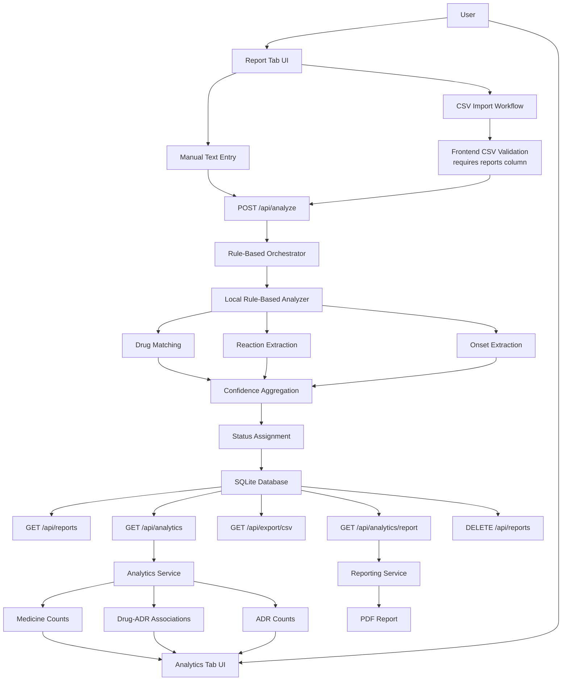

# ReportRx

ReportRx is a thesis-aligned prototype web application for **Adverse Drug Reaction (ADR) report analysis**. It accepts free-text ADR narratives written in English, Filipino, or code-switched Taglish, then converts them into structured report fields using a **purely local rule-based span-graph extraction pipeline**.

This `V1` version is the **clean rule-based build** of the prototype. It keeps the updated `Report` and `Analytics` user experience, but removes external model routing and runs entirely on the local extractor.

---

## What This Version Includes

- Rule-based ADR extraction for `drug_mention`, `reaction_mention`, and `onset`
- Report tab for manual report entry and review
- CSV import workflow for batch analysis using a required `reports` column
- Analytics tab with DB-driven visual summaries
- PDF analytics report generation
- SQLite persistence with sequential case IDs
- Clear-all reset flow that also resets the case counter

---

## Tech Stack

- **Backend:** Python 3.11+, FastAPI, Uvicorn
- **Frontend:** Jinja2 template, vanilla JavaScript, CSS
- **Charts:** Chart.js
- **Storage:** SQLite with WAL mode
- **PDF generation:** ReportLab + Matplotlib
- **Extraction engine:** thesis rule-based span-graph components from `extractor.py`, `patterns.py`, `preprocessing.py`, and `schema.py`

---

## Setup

### 1. Create and activate a virtual environment

```bash
python -m venv .venv

# Windows PowerShell
.venv\Scripts\Activate.ps1

# Windows CMD
.venv\Scripts\activate.bat

# macOS / Linux
source .venv/bin/activate
```

### 2. Install dependencies

```bash
pip install -r requirements.txt
```

### 3. Run the web app

```bash
uvicorn app.main:app --reload --port 8000
```

Open:

`http://127.0.0.1:8000`

### 4. Alternative Windows command

```bash
.venv\Scripts\python.exe -m uvicorn app.main:app --reload --port 8000
```

---

## High-Level Workflow

1. A user enters an ADR narrative manually or uploads a CSV file.
2. The backend normalizes the text and sends it to the local rule-based analyzer.
3. The analyzer extracts:
   - drug mentions
   - reaction mentions
   - onset cues
4. A confidence score is computed from the rule-based evidence.
5. The report is assigned one of three statuses:
   - `Accepted`
   - `Needs Review`
   - `Abstain`
6. The result is stored in SQLite with a sequential `case_id`.
7. The `Analytics` tab reads the persisted reports and generates:
   - medicine frequency summaries
   - ADR frequency summaries
   - drug-ADR association summaries
8. The user may export raw results as CSV or generate a formatted analytics PDF.

---

## System Architecture

### Architecture Graph



### Backend Layering

| Layer | File(s) | Responsibility |
|---|---|---|
| App entry | `app/main.py` | Starts FastAPI, mounts static files, initializes the DB, serves the main page |
| API layer | `app/api/routes.py` | Exposes analysis, reporting, analytics, export, and reset endpoints |
| Orchestration layer | `app/services/analyzers/orchestrator.py` | Sanitizes input, calls the local analyzer, assigns status, persists output |
| Local extraction layer | `app/services/analyzers/local_fallback_provider.py` | Acts as the local rule-based analyzer for medicine, reaction, and onset extraction |
| Persistence layer | `app/db.py` | Stores analyzed reports in SQLite and resets the sequence when cleared |
| Analytics layer | `app/services/analytics.py` | Aggregates counts and builds the drug-ADR association view |
| Reporting layer | `app/services/reporting.py` | Generates formatted PDF reports from analytics data |
| Frontend layer | `app/templates/index.html`, `app/static/app.js`, `app/static/styles.css` | Report tab, analytics tab, CSV import, charts, modals, and export controls |

---

## Rule-Based Analysis Pipeline

### 1. Input Normalization

The orchestrator normalizes whitespace and rejects empty input before analysis.

### 2. Drug Detection

The local rule-based analyzer uses a curated list of generic and brand-name medicines common in Philippine pharmacovigilance reporting, including examples such as:

- `amoxicillin`
- `paracetamol`
- `mefenamic acid`
- `Biogesic`
- `Neozep`
- `Alaxan`
- `Pfizer`
- `Moderna`

The provider preserves the original surface form found in the report text when possible.

### 3. Reaction Detection

Reaction extraction follows a two-stage strategy:

1. Try the thesis reaction span extractor from `preprocessing.py` + `extractor.py`
2. Fall back to a curated Tagalog-English reaction list if no thesis spans are returned

Example rule-covered reactions include:

- `nahilo`
- `nagka-rash`
- `sumakit ang ulo`
- `nasusuka`
- `rash`
- `nausea`
- `dizziness`
- `difficulty breathing`

### 4. Onset Detection

Onset extraction also follows a two-stage strategy:

1. Try the thesis onset span extractor
2. Fall back to regex-based temporal cues

Examples include:

- `maya-maya`
- `later`
- `bigla`
- `kinabukasan`
- `after 2 hours`
- `within 30 minutes`

### 5. Confidence Computation

The local analyzer computes a weighted score from the extracted channels:

- drug evidence
- reaction evidence
- onset evidence

The current logic emphasizes drug and reaction evidence most heavily, and applies softer scores when only partial information is found.

### 6. Status Assignment

The orchestrator maps the final confidence to:

- `Accepted` for `>= 0.70`
- `Needs Review` for `>= 0.40`
- `Abstain` for `< 0.40`

Any effectively empty extraction is treated as `Abstain`.

---

## User Interface

### Report Tab

The `Report` tab is the intake and storage workflow. It includes:

- a multiline ADR narrative text area
- an `Analyze Report` button
- an `Import CSV` button
- a results table populated from the DB
- `Export to CSV` and `Clear All` actions

The placeholder example is intentionally Taglish to signal support for bilingual and code-switched reporting styles.

### CSV Import Workflow

Batch import is handled in the frontend and uses the same `/api/analyze` endpoint as manual input.

Requirements:

- file type must be CSV
- the file must contain a column named exactly `reports`
- each non-empty row under `reports` is submitted for analysis

If accepted:

- the import modal closes
- the text area is replaced by a progress panel
- each row is analyzed and stored iteratively
- a completion modal prompts the user to reload

### Analytics Tab

The `Analytics` tab reads directly from the SQLite database and supports these views:

- `All`
- `Accepted`
- `Needs Review`

If the DB has no matching data for the selected view, the analytics panel remains empty and report generation is disabled.

---

## Analytics Logic

### 1. Top Medicines

The analytics service splits each stored `drug_mention` field on `|`, trims values, canonicalizes them, removes duplicates per report, and then counts them across the filtered dataset.

Outputs:

- pie chart
- ranked counts table

### 2. Top ADR Symptoms

The same process is applied to `reaction_mention`.

Outputs:

- pie chart
- ranked counts table

### 3. Top Drug-ADR Association

The association view is built iteratively from stored reports:

1. split the medicines found in a report
2. split the reactions found in the same report
3. pair every detected medicine with every detected reaction in that report
4. accumulate counts across all persisted records
5. for each medicine, keep the reaction with the highest pair count as its top associated ADR

Outputs:

- bar chart
- table with `Drug Name`, `Top ADR`, and `Count`

This makes the association panel cumulative: as more analyzed reports are stored in the DB, the counts update automatically.

---

## PDF Analytics Report

The `Generate Report` button downloads a formatted PDF based on the currently selected analytics view.

The report includes:

- ReportRx title and analytics heading
- selected data view such as `All`, `Accepted`, or `Needs Review`
- generation date and time
- medicine chart and table
- drug-ADR association chart and table
- ADR chart and table
- a `NOTES` column in the analytics tables for annotation

Implementation details:

- charts are rendered server-side with Matplotlib
- document layout is assembled with ReportLab
- each major analytics section is placed on its own page

---

## Data Model

Each stored report row contains:

| Field | Meaning |
|---|---|
| `case_id` | Sequential case identifier such as `case_00001` |
| `text_report` | Original normalized ADR narrative |
| `drug_mention` | Extracted medicine mentions joined by `|` |
| `reaction_mention` | Extracted reaction mentions joined by `|` |
| `onset` | Extracted onset cues joined by `|` |
| `raw_confidence` | Rule-based confidence score |
| `status` | `Accepted`, `Needs Review`, or `Abstain` |
| `latency_ms` | Local analysis latency in milliseconds |

The SQLite database is stored at:

`app/data/reportrx.db`

---

## API Endpoints

| Method | Path | Description |
|---|---|---|
| `GET` | `/` | Main single-page interface |
| `POST` | `/api/analyze` | Analyze one ADR report and persist it |
| `GET` | `/api/reports` | Return all stored reports |
| `DELETE` | `/api/reports` | Delete all stored reports and reset the case sequence |
| `GET` | `/api/export/csv` | Export stored report rows as CSV |
| `GET` | `/api/health` | Liveness check |
| `GET` | `/api/analytics?view=all` | Return analytics summary for a selected view |
| `GET` | `/api/analytics/report?view=all` | Generate analytics PDF for a selected view |

### Example `POST /api/analyze`

Request:

```json
{
  "text_report": "Uminom ako ng amoxicillin, then after 2 hours nagka-rash at nahilo ako."
}
```

Response:

```json
{
  "case_id": "case_00001",
  "text_report": "Uminom ako ng amoxicillin, then after 2 hours nagka-rash at nahilo ako.",
  "drug_mention": "amoxicillin",
  "reaction_mention": "nagka-rash at | nahilo",
  "onset": "after 2 hours",
  "raw_confidence": 0.8875,
  "status": "Accepted",
  "latency_ms": 0.4321
}
```

---

## Project Structure

```text
app/
|-- main.py                             # FastAPI app entry point
|-- config.py                           # Paths and confidence thresholds
|-- db.py                               # SQLite initialization and CRUD helpers
|-- api/
|   `-- routes.py                       # API endpoints
|-- services/
|   |-- analytics.py                    # Aggregation logic for dashboard views
|   |-- reporting.py                    # PDF report generation
|   `-- analyzers/
|       |-- base.py                     # AnalysisResult dataclass and analyzer interface
|       |-- local_fallback_provider.py  # Local rule-based extractor
|       `-- orchestrator.py             # Rule-based analysis coordinator
|-- static/
|   |-- app.js                          # Frontend behavior, import workflow, analytics rendering
|   `-- styles.css                      # Prototype styling
|-- templates/
|   `-- index.html                      # Report and Analytics tab UI
`-- data/
    `-- reportrx.db                     # Local SQLite database

extractor.py                            # Thesis reaction and onset span extraction
patterns.py                             # Regex patterns for bilingual cue matching
preprocessing.py                        # Text normalization for thesis extractor
schema.py                               # Span and graph data structures
calibration.py                          # Thesis calibration utilities
weak_supervision.py                     # Supporting thesis extraction helpers
```

---

## Thesis Alignment

This prototype is designed as a **review-assist system**, not an autonomous medical decision tool. Its purpose is to structure informal ADR narratives into auditable fields that can support pharmacovigilance review.

The design priorities in this build are:

- transparency
- structured extraction
- bilingual and code-switched input support
- confidence-aware triage
- local execution suitable for thesis demonstration
